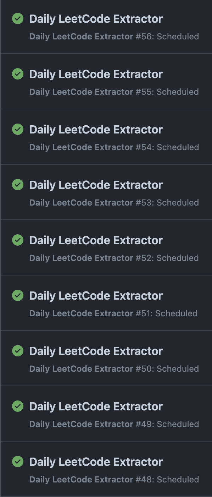

# Leetcode-Problem-Extractor

## Introduction

A web scraping tool that runs every day to extract Leetcode problem details.

Note: This project was created for academic purposes only. 

## Work Logs

- 2024/06/11

  - This project is initialized. Some messy documentation of my thoughts is written down.
  - Confirmed another scraping framework [BeautifulSoup](https://www.crummy.com/software/BeautifulSoup/bs4/doc/) doesn't work in this case since Leetcode is dynamic loading their properties into their website.

- 2024/06/12
  - Implemented the web scraping function using Selenium that successfully extracted [Leetcode](https://leetcode.com/) information.
  - Connected extracted Data with [MongoDB](https://www.mongodb.com).
  - Program generally crashes every 4th page in search attempts. Successfully searched 18 pages by adding a timer.
  - Successfully solved the crashing problem and now the program can extract 3183 [Leetcode](https://leetcode.com/) problem information stably.
- 2024/06/14
  - Fixed a crashing bug when running on headless mode on the server.
  - Created Logs to monitor the performance change throughout my project.
- 2024/06/15
  - Optimized database insertion process by using **batch inserts** with InsertOne and bulk_write, and by **establishing a single database connection**, significantly improving efficiency and performance for handling large datasets.
  - Encountered the **CAPTCHA** issue and attempted to solve it with fake human Behavior but failed.
  - Testing ran to the 35 page and failed, Leetcode returned a 502.
- 2024/06/16
  - Changed my implementation logic of scraping by using Queue to avoid interrupt by Cloudfare.
- 2024/06/17
  - Added Last Updated Time.
  - Tried to scrape the data with threading and received a 429 code saying my limit exceeded.
  - Ran the script with Surfshark VPN making the success rate stable around 58/64 which is 90.625%.

## Tech Stack used in this project

- [Leetcode](https://leetcode.com/)
- [Python](https://www.python.org)
- [Selenium](https://www.selenium.dev)
- [MongoDB](https://www.mongodb.com)

<!-- - Vite
- MongoDB
- Express js
- React js
- Node js
- RabbitMQ -->
